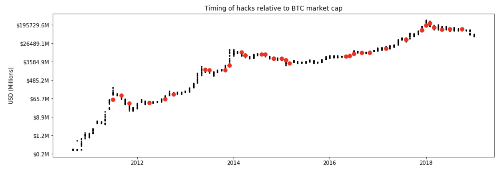
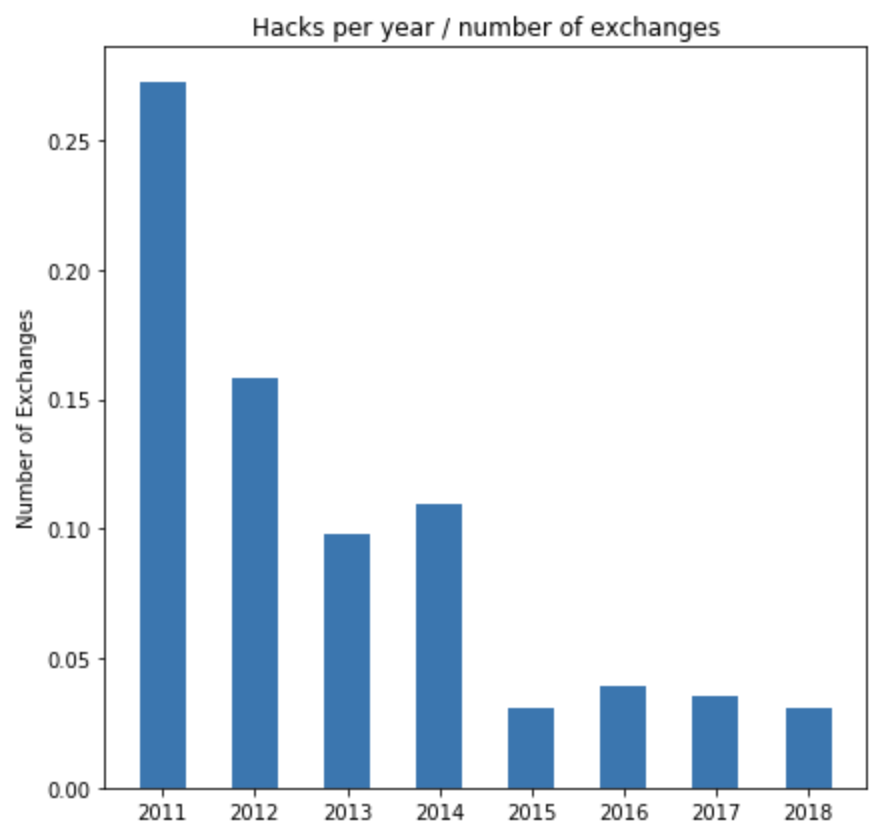
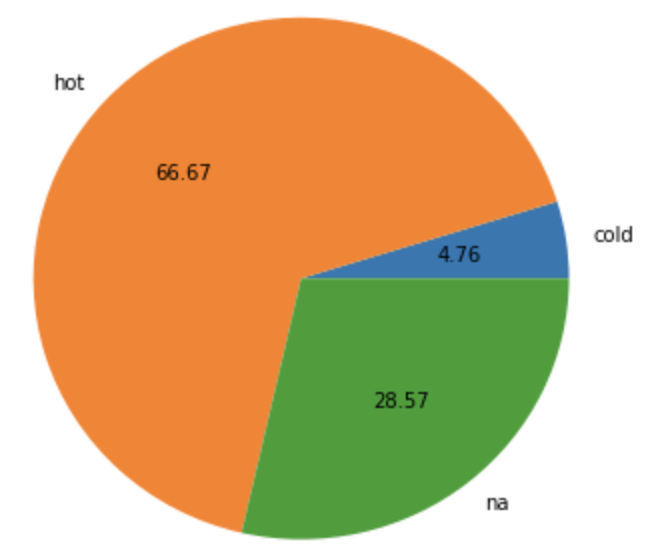

# Cryptocurrency hacks

This jupyter notebook contains some analysis I did on cryptocurrency hacks 

[Click here for the full report](https://dariusparvin.github.io/Cryptocurrency_hacks/)

Here are some example figures: 

<h3>Timing of hacks relative to Bitcoin market cap</h3>
Black points - Market Cap of Bitcoin (log scale)  
Red points - Timing of hack 

 
<h3>Number of hacks per year relative to the number of cryptocurrency exchanges in operation</h3>

 

<h3>Wallet type involved in hacks</h3>

